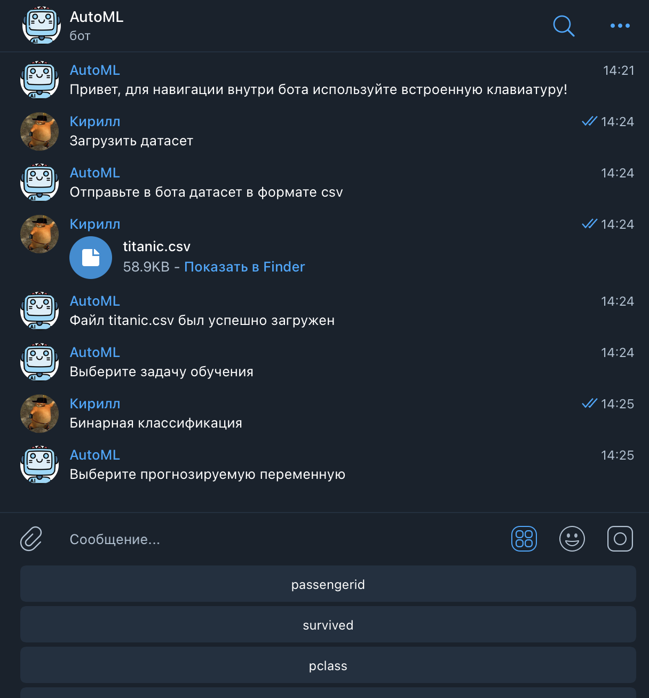

# AutoML

## Описание проекта

Данный проект является комбинацией машинного обучения с платформой телеграм. С помощью бота можно строить различные ML модели и с помощью них решать классические ML задачи (классификация, регрессия). Для построения моделей пользователю необходимо загрузить в бота датасет, выбрать задачу обучения, прогнозируемую переменную и модель. После этого бот в автоматическом режиме построит модель и оценит ее. После этого у пользователя будет возможность посмотреть важность признаков, построить новые модели либо же загрузить файл с отчетом по построенным моделям. 

## Реализованный функционал
- Логика взаимодействия между пользователем и ботом (с помощью всплывающих кнопок и машины состояний)
- Создание и хранение в пользовательской директории датасетов и моделей
- Задача бинарной классификации
- Класификационные модели (логистическая регрессия, CatboostClassifier)
- Классификационные метрики качества (F1, precision, recall, accuracy, roc-auc)
- Определение важности признаков 
- Генерация отчета по построенным моделям

## Планируемый функционал
- Расширение списка классификационных моделей
- Задача регрессии и метрики качества 
- Возможно задача множественной классификации и метрики качества

## Иллюстрация работы бота

	

		Начало работы
	

	

	

		Загрузка датасета
	

	

	

		Выбор задачи обучения
	

	

	

		Выбор прогнозируемой переменной
	

	

	

		Выбор желаемой модели
	

	

	

		Важность признаков
	

	

	

		Построение новой модели (логистическая регрессия)
	

	

	

		Возврат в начало меню
	

	

	

		Загрузка отчета по построенным моделям
	

	

	

		Сам отчет
	

	

